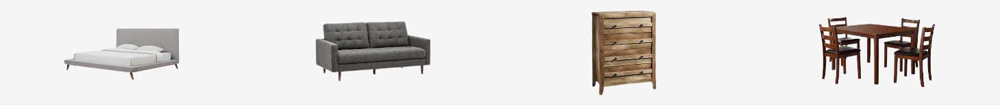

# Furniture as a Reflection of Values: Understanding customers' priorities in buying furniture to discover opportunity areas for Amazon's furniture line

Data Mining and Wrangling Mini Project 3 by Patrick Guillano La Rosa and Karen Patricia Reyes - August 25, 2021. The code, analysis, and the full report are included in the <a href="https://github.com/pgplarosa/Understanding-Customers-Priorities-to-Discover-Opportunity-Areas/blob/main/md/Main.md">Technical Report</a>. If you have any questions regarding this study, please send me a message via  <a href="https://www.linkedin.com/in/patricklarosa/">LinkedIn</a>.

## Executive Summary 

Amazon grew from a humble online bookseller in 1994 to the e-commerce giant we know today. They leveraged on the three basic concepts of customer preference, value for money, and convenience. The scale of its customer base brought about an equal amount of challenge in keeping up with diversified preferences across the different item categories they sell. The objective of this study is to focus on one of its lucrative lines – furniture and understand what components greatly affect how customers rate their purchasing experience.

Using the Amazon Customer Reviews Dataset for Furniture from 2002 to 2015 and limiting the scope of the study to the furniture item categories: desk, mattress, sofa, and drawer, we analyzed the general composition of the reviews in terms of the furniture item categories, the general distribution of customer ratings for all categories in scope, trends in the ratings over time, common words that appeared in each category, and the components that contributed mostly to the ratings per category.

Results show that across all categories, there seemed to be the common insight that customers highly value comfortability, ease of assembly, and value for money when purchasing furniture items from Amazon. We also highlighted the insight we have extracted from the low rating section of the reviews for the mattress sales. It appears that customers are having issues with the warranty policy of Amazon which we then suggested that the company look into despite low ratings having a significantly low proportion as compared to the high ratings.

For future studies, we suggested the expansion of the dataset to cover recent years and additional furniture item categories. We also recommended other angles that may be explored to produce more sound and fuller insights. One is comparing the performance of Amazon’s in-house furniture brands against the other brands they carry in the category. The other one is a more global approach where comparative analysis can be made to seek insights on the online furniture purchasing behavior of residents in the Western regions versus those in the Asian regions.

