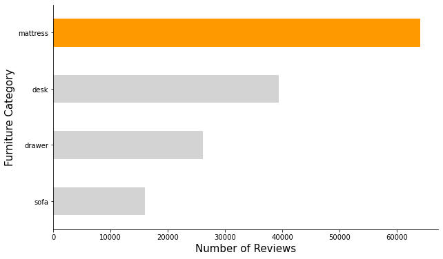
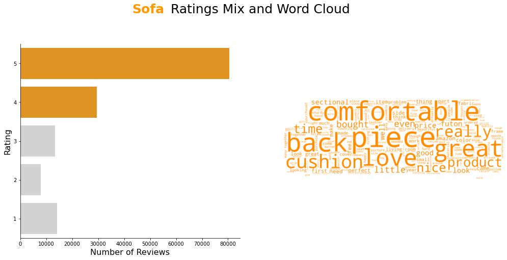
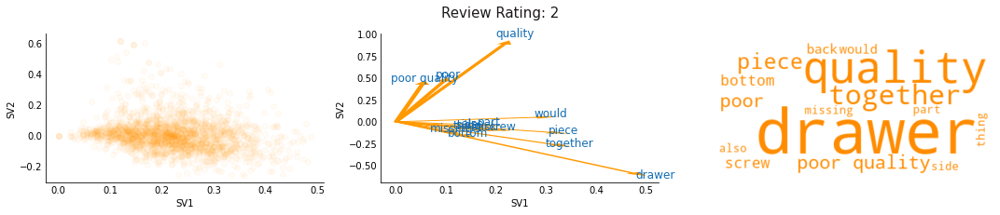

# Furniture as a Reflection of Values: Understanding customers' priorities in buying furniture to discover opportunity areas for Amazon's furniture line


```python
display(Image('img/banner.png'))
```


## Executive Summary

<p style="text-align:justify">Amazon grew from a humble online bookseller in 1994 to the e-commerce giant we know today. They leveraged on the three basic concepts of customer preference, value for money, and convenience. The scale of its customer base brought about an equal amount of challenge in keeping up with diversified preferences across the different item categories they sell. The objective of this study is to focus on one of its lucrative lines – furniture and understand what components greatly affect how customers rate their purchasing experience. 
<br><br>Using the Amazon Customer Reviews Dataset for Furniture from 2002 to 2015 and limiting the scope of the study to the furniture item categories: desk, mattress, sofa, and drawer, we analyzed the general composition of the reviews in terms of the furniture item categories, the general distribution of customer ratings for all categories in scope, trends in the ratings over time, common words that appeared in each category, and the components that contributed mostly to the ratings per category. 
<br><br>Results show that across all categories, there seemed to be the common insight that customers highly value comfortability, ease of assembly, and value for money when purchasing furniture items from Amazon. We also highlighted the insight we have extracted from the low rating section of the reviews for the mattress sales. It appears that customers are having issues with the warranty policy of Amazon which we then suggested that the company look into despite low ratings having a significantly low proportion as compared to the high ratings.
<br><br>For future studies, we suggested the expansion of the dataset to cover recent years and additional furniture item categories. We also recommended other angles that may be explored to produce more sound and fuller insights. One is comparing the performance of Amazon’s in-house furniture brands against the other brands they carry in the category. The other one is a more global approach where comparative analysis can be made to seek insights on the online furniture purchasing behavior of residents in the Western regions versus those in the Asian regions.</p>

## I. Introduction

<p style="text-align:justify">According to United States-based Consumer News and Business Channel (CNBC), Amazon remains to be the undisputed leader in the field of online retailing. The COVID-19 pandemic continues to drive consumers to do most if not yet their entire shopping online hence, e-commerce sales are increasing rapidly and Amazon’s share in these is projected increase substantially as well.$^1$ With Amazon’s increased dominance in online retailing, they are gaining more power to heavily influence negotiations with suppliers to their favor.
<br><br>Several companies rely heavily on Amazon thus, even with the increased demands, they try to play by the giant retailer’s rules just to keep their brand in the platform. However, some large companies who are more self-sustainable are starting to consider exiting Amazon and creating an online sales platform in their own websites to gain back control over their product pricing and interaction with consumers among many other. Since Amazon is the one directly selling to customers, they get to acquire valuable customer data which allows them to gain important insights on top-selling items. They then leverage on this by creating their own in-house brands to produce the items in a cost-efficient manner that will allow them to sell it for prices much lower than the original brands. This move by Amazon is obviously hurting the sales of brands selling on their platform. An example of which is Duracell’s previously top-selling batteries which have been overtaken by Amazon’s in-house batteries.$^2$
<br><br>Amazon may be winning the game right now, but the impending exit of its top brands can possibly take a turn for the worse. Hence, they need to make sure that consumers will continue to patronize their online sales platform by understanding what they value most in their online shopping experience. </p>


<b>Problem Statement</b>

<p style="text-align:justify">In this paper, we focus on the furniture section of Amazon. Furniture is one of the more expensive item categories consumers shop for. With the ongoing pandemic, consumers have gone online to purchase these despite the uncertainty brought about by not being able to see the items personally. Online sales for furniture items have been seen to increase recently and are expected to continue so with the prevailing work-from-home/ study-from-home setup these days. With consumers spending more time at home, we look into four categories of furniture which we believe are gaining wide increases in demand – <code>desk</code>, <code>mattress</code>, <code>sofa</code>, and <code>drawer</code>. We then aim to explore, <strong>what are the components that greatly affect the review ratings of furniture based on customer commentary feedback?</strong></p>

## II. Methodology

<p style="text-align:justify">The methodology used in the study are outlined below:</p>

<b>1. Data Processing</b>
<p style="text-align:justify">Extract dataset, store it in a pandas.DataFrame object, and clean the data by transforming into lower case, removing stop words, lemmatizing, etc. using nltk and pandas library</p>

<b>2. Perform Exploratory Data Analysis to explore reviews in the furniture category</b>
<p style="text-align:justify">In performing exploratory data analysis, modules including pandas, matplotlib, and wordcloud were used to manipulate data and generate visualizations. This step aims to glean insights on four primary aspects:</p>

<b>&nbsp;&nbsp;&nbsp;&nbsp;&nbsp;&nbsp;&nbsp;&nbsp;i. <i>Number of Reviews over the years</i></b><br>
&nbsp;&nbsp;&nbsp;&nbsp;&nbsp;&nbsp;&nbsp;&nbsp;By using line plot we can compare the number of reviews per year and the total number of votes.<br>
<b>&nbsp;&nbsp;&nbsp;&nbsp;&nbsp;&nbsp;&nbsp;&nbsp;ii. <i>Distribution of the number of category sold overall</i></b><br>
&nbsp;&nbsp;&nbsp;&nbsp;&nbsp;&nbsp;&nbsp;&nbsp;By using bar plots we can explore the distribution of the number of samples that we got that belongs to the chosen category.<br>
<b>&nbsp;&nbsp;&nbsp;&nbsp;&nbsp;&nbsp;&nbsp;&nbsp;iii. <i>Distribution of the overall review rating that Amazon received</i></b><br>
&nbsp;&nbsp;&nbsp;&nbsp;&nbsp;&nbsp;&nbsp;&nbsp;By using bar plots we can explore the overall distribution of the review ratings and create an overall insights of their performance<br>
<b>&nbsp;&nbsp;&nbsp;&nbsp;&nbsp;&nbsp;&nbsp;&nbsp;iv. <i>Trends of the overall rating that the Amazon received throughout the years</i></b><br>
&nbsp;&nbsp;&nbsp;&nbsp;&nbsp;&nbsp;&nbsp;&nbsp;By using line plots we can explore the trend of the ratings and see if the review rating is improving over the years.<br>
<b>&nbsp;&nbsp;&nbsp;&nbsp;&nbsp;&nbsp;&nbsp;&nbsp;v. <i>Explore on the common words that appear in a category</i></b><br>
&nbsp;&nbsp;&nbsp;&nbsp;&nbsp;&nbsp;&nbsp;&nbsp;By using word cloud and bar plots we can visualize the most common words that appear in a category.<br>
<b>&nbsp;&nbsp;&nbsp;&nbsp;&nbsp;&nbsp;&nbsp;&nbsp;vi. <i>Dimentionality reduction</i></b><br>
&nbsp;&nbsp;&nbsp;&nbsp;&nbsp;&nbsp;&nbsp;&nbsp;By performing SVD as our dimentionality reduction method, we can plot the explained variance and get an idea on the possible variations.<br>
<b>&nbsp;&nbsp;&nbsp;&nbsp;&nbsp;&nbsp;&nbsp;&nbsp;vii. <i>Latent Semantic Analysis</i></b><br>
&nbsp;&nbsp;&nbsp;&nbsp;&nbsp;&nbsp;&nbsp;&nbsp;By performing LSA on our data, we could determine the components that make up the ratings per category while mitigating synonymy.<br>

<p>Each steps outlined are going to be discussed in detail on the succeeding sections.</p>

## III. Data Processing


```python
# import libraries
import pandas as pd
import numpy as np
import os
import pickle
from collections import defaultdict
from matplotlib import pyplot as plt
import seaborn as sns
from wordcloud import WordCloud
from PIL import Image

import nltk
from nltk.stem import WordNetLemmatizer
from nltk.corpus import stopwords
# Download nltk requirements
# nltk.download('punkt')
# nltk.download('wordnet')
# nltk.download('stopwords')

from sklearn.feature_extraction.text import TfidfVectorizer
from sklearn.decomposition import TruncatedSVD

from IPython.display import HTML, Image

from tqdm import tqdm
tqdm.pandas()

# define constants
AMAZON_COLORS = ['#000000', '#FF9900', '#146EB4', 
                 '#FFFFFF', '#232F3E', '#EDEDED',
                 '#F0A758', '#1C1919']

# Toggle codes and center figures
HTML('''<script>
code_show=false; 
function code_toggle() {
 if (code_show){
 $('div.input').hide();
 } else {
 $('div.input').show();
 }
 code_show = !code_show
} 
$( document ).ready(code_toggle);
</script>
<style>
.output_png {
    display: table-cell;
    text-align: center;
    horizontal-align: middle;
    vertical-align: middle;
    margin:auto;
}
</style>
<form action="javascript:code_toggle()">
<input type="submit" value="Click to toggle on/off the raw code.">
</form>''')
```


<script>
code_show=false; 
function code_toggle() {
 if (code_show){
 $('div.input').hide();
 } else {
 $('div.input').show();
 }
 code_show = !code_show
} 
$( document ).ready(code_toggle);
</script>
<style>
.output_png {
    display: table-cell;
    text-align: center;
    horizontal-align: middle;
    vertical-align: middle;
    margin:auto;
}
</style>
<form action="javascript:code_toggle()">
<input type="submit" value="Click to toggle on/off the raw code.">
</form>


### A. Extract Dataset

We extracted the Amazon Customer Reviews on furniture from 2000 to 2015 and loaded it to a dataframe.


```python
pth = '/mnt/data/public/amazon-reviews/'
fname = 'amazon_reviews_us_Furniture_v1_00.tsv.gz'
df = pd.read_csv(os.path.join(pth, fname), 
                 delimiter='\t', compression='gzip', error_bad_lines=False,
                 warn_bad_lines=False)
```

### B. Preprocess Dataset

#### i. Cleaning of dataset

1. We chose on the variables of interest namely `product_title`, `star_rating`, `review_body`, `review_date`, and `total_votes` that we used for the analysis of this study;
2. We then got the common pieces of furniture that Amazon offers such as *Desk*, *Sofa*, *Mattress*, and *Drawer*.


```python
# retain only relevant columns for analysis
df_review = df.loc[:, ['product_title', 
                       'star_rating', 'review_body',
                       'review_date', 'total_votes']]

# get category bed, sofa, desk, pillow, drawer
search_string = '(desk|sofa|mattress|drawer)'
df_review['subcat'] = (df_review.product_title.str.casefold()
                                 .str.extract(fr'{search_string}'))

df_review_top = df_review.dropna().copy()

display(HTML('''<center style="font-size:12px;font-style:default;">
<b>Table 1. Raw data from Amazon dataset.</b></center>'''))
display(df_review_top.head())
```


<center style="font-size:12px;font-style:default;">
<b>Table 1. Raw data from Amazon dataset.</b></center>


<div>
<style scoped>
    .dataframe tbody tr th:only-of-type {
        vertical-align: middle;
    }

    .dataframe tbody tr th {
        vertical-align: top;
    }

    .dataframe thead th {
        text-align: right;
    }
</style>
<table border="1" class="dataframe">
  <thead>
    <tr style="text-align: right;">
      <th></th>
      <th>product_title</th>
      <th>star_rating</th>
      <th>review_body</th>
      <th>review_date</th>
      <th>total_votes</th>
      <th>subcat</th>
    </tr>
  </thead>
  <tbody>
    <tr>
      <th>0</th>
      <td>Shoal Creek Computer Desk</td>
      <td>4</td>
      <td>This desk is very study and it i has  a beauti...</td>
      <td>2015-08-31</td>
      <td>0</td>
      <td>desk</td>
    </tr>
    <tr>
      <th>2</th>
      <td>Bathroom Vanity Table Jewelry Makeup Desk Benc...</td>
      <td>5</td>
      <td>Perfect fit for my bedroom, been wanting one s...</td>
      <td>2015-08-31</td>
      <td>1</td>
      <td>desk</td>
    </tr>
    <tr>
      <th>3</th>
      <td>Sleep Master Ultima Comfort Memory Foam 6 Inch...</td>
      <td>3</td>
      <td>We use this on a trundle bed.  So, it does not...</td>
      <td>2015-08-31</td>
      <td>0</td>
      <td>mattress</td>
    </tr>
    <tr>
      <th>22</th>
      <td>Etna Sofa Side Table (Black)</td>
      <td>3</td>
      <td>Functional but too lightweight - I ordered 2 a...</td>
      <td>2015-08-31</td>
      <td>0</td>
      <td>sofa</td>
    </tr>
    <tr>
      <th>24</th>
      <td>Signature Sleep Contour 8 Inch Independently E...</td>
      <td>5</td>
      <td>so comfortable!</td>
      <td>2015-08-31</td>
      <td>0</td>
      <td>mattress</td>
    </tr>
  </tbody>
</table>
</div>


<p style="text-align:justify">We performed the following <b>preprocessing techniques</b> for the reviews text listed below:
<ol>
    <li> We used <code>nltk punkt</code> to properly tokenize the words in English that are going to be useful in the succeeding preprocessing of reviews.
    <li> We then performed casefolding to enable case-insensitive reviews such that we want <code>GOOD</code> and <code>good</code> to be counted as single word. 
    <li> We also decided to perform lemmatization from <code>nltk WordNetLemmatizer</code> to the tokens such that we want <code>bed</code> and <code>beds</code> to be counted as single word. Treating the root words separately would not accurately capture the importance of the word in our analysis.
    <li> We removed english stopwords from <code>nltk stopwords</code> to prevent low-level information such as <code>about</code>, <code>without</code>, etc from our reviews in order to give more importance to the relevant information
<li> We filtered words with less than 3 character length prevent words like <code>the</code>, <code>be</code> that wouldn't have importance for our analysis 
    <li> Lastly, we filtered common furniture words such as <code>desk</code>, <code>sofa</code>, etc. because if they are reviewing that product we expect to see these words frequently which is not very informative and dilutes the importance of other describing words such as <code>soft</code>, <code>comfortable</code>.
</ol></p>


```python
# tokenize
tokenize = df_review_top.review_body.progress_apply(nltk.word_tokenize)

# casefold
lower_case = tokenize.progress_apply(lambda x:
                                     list(map(lambda y: y.casefold(), x)))


# lemmatize
lemmatizer = WordNetLemmatizer()
lemmatize = lower_case.progress_apply(lambda x: list(map(lemmatizer.lemmatize,
                                                         x)))

# remove stopwords
stop_words = set(stopwords.words('english'))
filtered_stopwords = lemmatize.progress_apply(lambda x:
                                              list(filter(lambda y: y
                                                          not in stop_words,
                                                          x)))

# filter words with less than 3 character length
filtered_words = filtered_stopwords.progress_apply(lambda x:
                                                   list(filter(lambda y:
                                                               len(y) > 3,
                                                               x)))


# filter common furniture words
furn_words = ['sofa', 'desk', 'chair', 'mattress', 'couch',
              'dresser', 'table', 'furniture']
filtered_words = filtered_words.progress_apply(lambda x:
                                               list(filter(lambda y: y
                                                           not in
                                                           furn_words,
                                                           x)))
```

    100%|██████████| 145633/145633 [02:05<00:00, 1164.07it/s]
    100%|██████████| 145633/145633 [00:03<00:00, 37448.39it/s]
    100%|██████████| 145633/145633 [00:53<00:00, 2704.19it/s]
    100%|██████████| 145633/145633 [00:03<00:00, 39568.86it/s]
    100%|██████████| 145633/145633 [00:01<00:00, 83273.00it/s]
    100%|██████████| 145633/145633 [00:03<00:00, 47014.26it/s]
    


```python
df_review_top['review_clean_tokenize'] = filtered_words
```

We transformed tokenized words to review string


```python
df_review_top['review_clean'] = (df_review_top.review_clean_tokenize
                                 .apply(' '.join))

display(HTML('''<center style="font-size:12px;font-style:default;">
<b>Table 2. Clean dataset after performing preprocessing techniques.
</b></center>'''))
display(df_review_top.head())
```


<center style="font-size:12px;font-style:default;">
<b>Table 2. Clean dataset after performing preprocessing techniques.
</b></center>


<div>
<style scoped>
    .dataframe tbody tr th:only-of-type {
        vertical-align: middle;
    }

    .dataframe tbody tr th {
        vertical-align: top;
    }

    .dataframe thead th {
        text-align: right;
    }
</style>
<table border="1" class="dataframe">
  <thead>
    <tr style="text-align: right;">
      <th></th>
      <th>product_title</th>
      <th>star_rating</th>
      <th>review_body</th>
      <th>review_date</th>
      <th>total_votes</th>
      <th>subcat</th>
      <th>review_clean_tokenize</th>
      <th>review_clean</th>
    </tr>
  </thead>
  <tbody>
    <tr>
      <th>0</th>
      <td>Shoal Creek Computer Desk</td>
      <td>4</td>
      <td>This desk is very study and it i has  a beauti...</td>
      <td>2015-08-31</td>
      <td>0</td>
      <td>desk</td>
      <td>[study, beautiful, finish, think, little, pric...</td>
      <td>study beautiful finish think little pricey size</td>
    </tr>
    <tr>
      <th>2</th>
      <td>Bathroom Vanity Table Jewelry Makeup Desk Benc...</td>
      <td>5</td>
      <td>Perfect fit for my bedroom, been wanting one s...</td>
      <td>2015-08-31</td>
      <td>1</td>
      <td>desk</td>
      <td>[perfect, bedroom, wanting, since, little, girl]</td>
      <td>perfect bedroom wanting since little girl</td>
    </tr>
    <tr>
      <th>3</th>
      <td>Sleep Master Ultima Comfort Memory Foam 6 Inch...</td>
      <td>3</td>
      <td>We use this on a trundle bed.  So, it does not...</td>
      <td>2015-08-31</td>
      <td>0</td>
      <td>mattress</td>
      <td>[trundle, much, much, better, choice, getting,...</td>
      <td>trundle much much better choice getting spring...</td>
    </tr>
    <tr>
      <th>22</th>
      <td>Etna Sofa Side Table (Black)</td>
      <td>3</td>
      <td>Functional but too lightweight - I ordered 2 a...</td>
      <td>2015-08-31</td>
      <td>0</td>
      <td>sofa</td>
      <td>[functional, lightweight, ordered, attached, t...</td>
      <td>functional lightweight ordered attached together</td>
    </tr>
    <tr>
      <th>24</th>
      <td>Signature Sleep Contour 8 Inch Independently E...</td>
      <td>5</td>
      <td>so comfortable!</td>
      <td>2015-08-31</td>
      <td>0</td>
      <td>mattress</td>
      <td>[comfortable]</td>
      <td>comfortable</td>
    </tr>
  </tbody>
</table>
</div>


We saved the clean dataset to a pickle file so that a user will not have to run all the commands above all the time.


```python
df_review_top.to_pickle('clean_amazon_dataset.pkl')
```

#### iii. Transform review text into its vector representation

<p style="text-align:justify">Fit and transform to Tf-idf vector using <code>sklearn.feature_extraction.text.TfidfVectorizer</code>. We have used the following parameters for the <code>TfidfVectorizer</code>:
<ul>
    <li>token_pattern : <code>r'\b[a-z]+\b'</code> - We have defined words as strictly composed of letters in the alphabet prefixed and suffixed by a word boundary</li>
    <li>ngram_range : <code>(1, 2)</code> - We used 1 to 2 ngrams to capture single and compound words such as <i>computer desk</i>, and <i>desk</i></li>
    <li>max_df : <code>0.8</code> - We set the limit of the maximum document frequency to be 80% to remove words that appear too frequently</li>
    <li>min_df : <code>0.01</code> - We set the limit of the minimum document frequency to be 1% to ignore the words that appear too infrequently to our data that would improve also the performance of our model.</li></p>


```python
# initialize tfidf vectorizer
tfidf_vectorizer = TfidfVectorizer(token_pattern=r'\b[a-z]+\b', 
                                   ngram_range=(1, 2),
                                   max_df=0.8,
                                   min_df=0.01)

# get bag of words representation
bow_ng_all = defaultdict(dict)
for cat in tqdm(df_review_top.subcat.unique()):
    for i in range(1, 6):
        prod = df_review_top[(df_review_top.subcat==cat) & 
                             (df_review_top.star_rating==i)].copy()
        bow_ng = tfidf_vectorizer.fit_transform(prod['review_clean'])
        df_bow = pd.DataFrame.sparse.from_spmatrix(
                    bow_ng, columns=tfidf_vectorizer.get_feature_names())

        bow_ng_all[cat][i] = df_bow
```

    100%|██████████| 4/4 [00:11<00:00,  2.97s/it]
    

We saved the TfidfVector representation of our reviews in a pickle file to preserve the python object representation of our reviews since it is a dictionary.


```python
# save as pickle file to preserve datatypes
with open('bow_ng.pkl', 'wb') as f:
    pickle.dump(bow_ng_all, f, protocol=pickle.HIGHEST_PROTOCOL)
```


```python
# read pickle file
with open('bow_ng.pkl', 'rb') as f:
    bow_ng_all = pickle.load(f)

display(HTML('''<center style="font-size:12px;font-style:default;">
<b>Table 3. TF-IDF vector representation of the reviews.
</b></center>'''))
display(bow_ng_all['desk'][1].head())
```


<center style="font-size:12px;font-style:default;">
<b>Table 3. TF-IDF vector representation of the reviews.
</b></center>


<div>
<style scoped>
    .dataframe tbody tr th:only-of-type {
        vertical-align: middle;
    }

    .dataframe tbody tr th {
        vertical-align: top;
    }

    .dataframe thead th {
        text-align: right;
    }
</style>
<table border="1" class="dataframe">
  <thead>
    <tr style="text-align: right;">
      <th></th>
      <th>able</th>
      <th>absolutely</th>
      <th>actual</th>
      <th>actually</th>
      <th>almost</th>
      <th>along</th>
      <th>already</th>
      <th>also</th>
      <th>although</th>
      <th>always</th>
      <th>...</th>
      <th>worse</th>
      <th>worst</th>
      <th>worth</th>
      <th>worth money</th>
      <th>would</th>
      <th>would never</th>
      <th>would recommend</th>
      <th>write</th>
      <th>wrong</th>
      <th>year</th>
    </tr>
  </thead>
  <tbody>
    <tr>
      <th>0</th>
      <td>0.0</td>
      <td>0.0</td>
      <td>0.0</td>
      <td>0.0</td>
      <td>0.0</td>
      <td>0.0</td>
      <td>0.0</td>
      <td>0.000000</td>
      <td>0.0</td>
      <td>0.0</td>
      <td>...</td>
      <td>0.0</td>
      <td>0.0</td>
      <td>0.0</td>
      <td>0.0</td>
      <td>0.000000</td>
      <td>0.0</td>
      <td>0.000000</td>
      <td>0.0</td>
      <td>0.0</td>
      <td>0.0</td>
    </tr>
    <tr>
      <th>1</th>
      <td>0.0</td>
      <td>0.0</td>
      <td>0.0</td>
      <td>0.0</td>
      <td>0.0</td>
      <td>0.0</td>
      <td>0.0</td>
      <td>0.000000</td>
      <td>0.0</td>
      <td>0.0</td>
      <td>...</td>
      <td>0.0</td>
      <td>0.0</td>
      <td>0.0</td>
      <td>0.0</td>
      <td>0.096911</td>
      <td>0.0</td>
      <td>0.000000</td>
      <td>0.0</td>
      <td>0.0</td>
      <td>0.0</td>
    </tr>
    <tr>
      <th>2</th>
      <td>0.0</td>
      <td>0.0</td>
      <td>0.0</td>
      <td>0.0</td>
      <td>0.0</td>
      <td>0.0</td>
      <td>0.0</td>
      <td>0.164132</td>
      <td>0.0</td>
      <td>0.0</td>
      <td>...</td>
      <td>0.0</td>
      <td>0.0</td>
      <td>0.0</td>
      <td>0.0</td>
      <td>0.227566</td>
      <td>0.0</td>
      <td>0.207452</td>
      <td>0.0</td>
      <td>0.0</td>
      <td>0.0</td>
    </tr>
    <tr>
      <th>3</th>
      <td>0.0</td>
      <td>0.0</td>
      <td>0.0</td>
      <td>0.0</td>
      <td>0.0</td>
      <td>0.0</td>
      <td>0.0</td>
      <td>0.000000</td>
      <td>0.0</td>
      <td>0.0</td>
      <td>...</td>
      <td>0.0</td>
      <td>0.0</td>
      <td>0.0</td>
      <td>0.0</td>
      <td>0.000000</td>
      <td>0.0</td>
      <td>0.000000</td>
      <td>0.0</td>
      <td>0.0</td>
      <td>0.0</td>
    </tr>
    <tr>
      <th>4</th>
      <td>0.0</td>
      <td>0.0</td>
      <td>0.0</td>
      <td>0.0</td>
      <td>0.0</td>
      <td>0.0</td>
      <td>0.0</td>
      <td>0.000000</td>
      <td>0.0</td>
      <td>0.0</td>
      <td>...</td>
      <td>0.0</td>
      <td>0.0</td>
      <td>0.0</td>
      <td>0.0</td>
      <td>0.000000</td>
      <td>0.0</td>
      <td>0.000000</td>
      <td>0.0</td>
      <td>0.0</td>
      <td>0.0</td>
    </tr>
  </tbody>
</table>
<p>5 rows × 586 columns</p>
</div>


### C. Data Description

<p style="text-align:justify">This study uses data that was extracted from Amazon datasets that can be found on this <a href="https://registry.opendata.aws/amazon-reviews/">link</a>. Amazon provides open source datasets regarding any topics such as space, health, and many more. In this study, we used Amazon Customer Reviews Dataset, in particular, in the category of furnitures between 2000 to 2015. We decided to limit our scope as well to the common furnitures that are being offered in Amazon such as <i>Desk</i>, <i>Sofa</i>, <i>Mattress</i>, and <i>Drawer</i>. The data includes features such as <code>product_title</code>, <code>star_rating</code>, <code>review_date</code>, <code>review_body</code>, and the <code>total_votes</code>. In addition, we have created a new feature such as <code>subcat</code>, and <code>review_clean_tokenize</code> that we will be using for our analysis.</p>

Our dataset contains 145,633 number of reviews with features indicated in Table 4.
<center style="font-size:12px;font-style:default;"><b>Table 4. Descriptions of the features used.</b></center>

| Column | Data type | Description | 
| :---- | :---------: | :----- |
| `product_title` | string | The product that is being reviewed |
| `star_rating` | integer | Rating of the review that ranges from one to five with five being most satisfied |
| `review_body	` | string | Review of the product |
| `review_date	` | date | Date of the review formatted as (YYYY-MM-DD) |
| `total_votes` | integer | Total number of votes per review |
| `subcat` | string | Category of the furnitures (desk, sofa, mattress, drawer) |
| `review_clean_tokenize` | list | Tokenized and preprocessed representation of the reviews |


## IV. Exploratory Data Analysis

### A. Reviews through the Years


```python
display(HTML('''<center style="font-size:12px;font-style:default;"><b>
Figure 1. Number of reviews and votes per year.</b></center>'''))

date = pd.to_datetime(df_review_top.review_date)
df_review_top.groupby(date.dt.year)['total_votes'].sum()

display(HTML(f'''<h3 style="text-align:center">
                More customers
                are being <b style="color:{AMAZON_COLORS[1]}">
                active</b> in the review section of their platform 
                per year
                </h3>'''))
plt.figure(figsize=(10, 6))
plt.plot(df_review_top.groupby(date.dt.year)['total_votes'].sum(), 
        label='Number of Total Votes per year', lw=4.0, 
        color=AMAZON_COLORS[1])
plt.plot(df_review_top.groupby(date.dt.year).size(), 
         label='Number of Reviews per Year', lw=4.0,
         color=AMAZON_COLORS[2])
spines = ['right', 'top']
ax = plt.gca()
[ax.spines[spine].set_visible(False) for spine in spines]
plt.legend()
plt.xlabel('Year')
plt.ylabel('Count');
```


<center style="font-size:12px;font-style:default;"><b>
Figure 1. Number of reviews and votes per year.</b></center>


<h3 style="text-align:center">
                More customers
                are being <b style="color:#FF9900">
                active</b> in the review section of their platform 
                per year
                </h3>


We can see in figure 1 the trend of the number of reviews and votes per year, we can see that it is steadily growing exponentially. This is expected as we move to the digital era customers are looking for physical evidence on a specific product before buying it.

### B. Furniture Line Proportion of Categories


```python
display(HTML('''<center style="font-size:12px;font-style:default;"><b>
Figure 2. Number of reviews per category.</b></center>'''))

display(HTML(f'''<h3 style="text-align:center">
                The <b style="color:{AMAZON_COLORS[1]}">
                mattress</b> category dominates the
                customer review section
                </h3>'''))

fture_df = pd.read_pickle('clean_amazon_dataset.pkl')
cat_mix = fture_df['subcat'].value_counts(ascending=True)
plt.figure(figsize=(10, 6))
cat_mix.plot.barh(color=['lightgray'] * 3 + [AMAZON_COLORS[1]])
plt.xlabel("Number of Reviews", fontsize=15)
plt.ylabel("Furniture Category", fontsize=15)
ax = plt.gca()
ax.spines['top'].set_visible(False)
ax.spines['right'].set_visible(False)
plt.show()
```


<center style="font-size:12px;font-style:default;"><b>
Figure 2. Number of reviews per category.</b></center>


<h3 style="text-align:center">
                The <b style="color:#FF9900">
                mattress</b> category dominates the
                customer review section
                </h3>





<p style="text-align:justify">Figure 2 shows the proportion of the total number of reviews attributable to each furniture category included in this study. We can see that the mattress category tops in percentage which implies that it is among Amazon's top selling items in the furniture line. This insight is hardly surprising given that people in general spend more time on their bed compared to any other furniture.
<br><br>Coming in second is the desk category. Even before the COVID-19 pandemic, desks have already been a staple in households and office alike for working, studying, writing, etc.</p>

### C. Overall Average Customer Ratings for the Furniture Line


```python
display(HTML('''<center style="font-size:12px;font-style:default;"><b>
Figure 3. Number of reviews per rating.</b></center>'''))

display(HTML(f'''<h3 style="text-align:center">
                <b style="color:{AMAZON_COLORS[1]}">
                High ratings</b> dominate the customer review section
                </h3>'''))

cat_mix = fture_df['star_rating'].value_counts().sort_index()
plt.figure(figsize=(10, 6))
cat_mix.plot.barh(color=['lightgray','lightgray', 'lightgray',
                         AMAZON_COLORS[1], AMAZON_COLORS[1]])
plt.xlabel("Number of Reviews", fontsize=15)
plt.ylabel("Rating", fontsize=15)
ax = plt.gca()
ax.spines['top'].set_visible(False)
ax.spines['right'].set_visible(False)
plt.show()
```


<center style="font-size:12px;font-style:default;"><b>
Figure 3. Number of reviews per rating.</b></center>


<h3 style="text-align:center">
                <b style="color:#FF9900">
                High ratings</b> dominate the customer review section
                </h3>


Figure 3 shows that majority of the average customer ratings for Amazon's furniture items from 2002 to 2015 are in the upper part of the spectrum. This is reflective of why Amazon was able to maintain a large customer base.

### D. Average Ratings of Furniture Line through Time


```python
display(HTML('''<center style="font-size:12px;font-style:default;"><b>
Figure 4. Average ratings of furniture sales per year.</b></center>'''))

fture_df_time = fture_df.copy()
fture_df_time['review_date'] = pd.to_datetime(fture_df_time['review_date'])
fture_df_time = fture_df_time.loc[fture_df_time.review_date.dt.year != 2001]
rate_time_year = (fture_df_time.groupby(pd.Grouper(key="review_date",
                                                   freq="Y"))['star_rating']
                  .mean())
plt.figure(figsize=(10, 6))
rate_time_year.plot.line(color=AMAZON_COLORS[1])
plt.xlabel("Time (Yearly)", fontsize=14)
plt.ylabel("Rating Average", fontsize=14)
plt.title("After 2008, average ratings steadily increased", fontsize=20)
ax = plt.gca()
ax.spines['top'].set_visible(False)
ax.spines['right'].set_visible(False)
plt.show()
```


<center style="font-size:12px;font-style:default;"><b>
Figure 4. Average ratings of furniture sales per year.</b></center>


<p style="text-align:justify">Looking at figure 4, we can see that the lowest dip occurred in 2004. After 2004, Amazon was able to raise the average ratings again until 2006 where a peak was reached before they went down again. A dip in the average ratings was experienced again in 2008, but after which, they increased steadily.
<br><br>For the 2004 dip, further analysis is needed to understand why the case was so. <br>For the 2008 dip, it can be surmised that due to the Financial Crisis then, consumers were driven to be more thrifty and rigid in their evaluation of the value for money of items bought.<br>The steady increase after 2008 may imply that Amazon was able to understand their consumers better and implement the changes needed every year to satisfy their needs and wants in terms of furniture items.</p>


```python
display(HTML('''<center style="font-size:12px;font-style:default;"><b>
Figure 5. Average ratings of furniture sales per month.</b></center>'''))

rate_time_month = (fture_df_time.groupby(pd.Grouper(key="review_date",
                                                    freq="M"))['star_rating']
                   .mean())
plt.figure(figsize=(10, 6))
rate_time_month.plot.line(color=AMAZON_COLORS[1])
plt.xlabel("Time (Monthly)", fontsize=14)
plt.ylabel("Rating Average", fontsize=14)
plt.title("Seasonality in monthly ratings decreased from 2007 onwards", 
          fontsize=20)
ax = plt.gca()
ax.spines['top'].set_visible(False)
ax.spines['right'].set_visible(False)
plt.show()
```


<center style="font-size:12px;font-style:default;"><b>
Figure 5. Average ratings of furniture sales per month.</b></center>


<p style="text-align:justify">Zooming in on the average ratings over time graph by looking at the monthly perspective, we witness the presence of seasonality. Amazon had a fairly constant seasonality from 2002 until mid-2005 when the amplitude started to increase. The fluctuating volatility in the ratings continued until mid-2006. The average ratings became less and less volatile from 2007 onwards. Although seasonality was still present from 2014 to 2015, it is also notable that the average ratings seem to be steadily increasing at the time.
<br><br>Consistent with the yearly graph, we can see that in the latter years, Amazon seems to have been able to resolve the issues brought up in the low ratings. However, unlike the yearly graph where we saw the lowest dip in 2004, this monthly graph shows the lowest dip in the last leg of 2005.</p>

## V. Results and Discussion

### A. Ratings Mix and Word Cloud for each Furniture Category


```python
word_cloud = pd.read_pickle('clean_amazon_dataset.pkl')


def orange_color(word, **kwargs):
    """Create a palette for the word cloud to be generated"""
    np.random.seed(0)
    return np.random.choice(['darkorange', 'orange', 'bisque'])


def create_word_cloud(sub_cat, title_hori_position):
    """ Generate a wordcloud based on the category specified
    Parameters
    ----------
    sub_cat              :  string
                            furniture line category
    title_hori_position  :  float
                            x position to place the category name in the text
    """
    try:
        mask = np.array(Image.open(str(sub_cat)+".jpg"))
    except:
        mask = np.array(Image.open(str(sub_cat)+".png"))
    category = word_cloud[(word_cloud.subcat == sub_cat)]
    fig, ax = plt.subplots(1, 2, figsize=(17, 7))

    sns.countplot(y=word_cloud.star_rating, order=[5, 4, 3, 2, 1],
                  palette=[AMAZON_COLORS[1], AMAZON_COLORS[1], 'lightgray',
                           'lightgray', 'lightgray'], ax=ax[0])
    word_cloud['review_clean'] = (word_cloud['review_clean_tokenize']
                                  .apply(' '.join))
    word_cloud_cat = word_cloud[word_cloud.subcat == sub_cat]
    text = ' '.join(word_cloud_cat['review_clean'].to_list())
    generated_wc = (WordCloud(mask=mask, background_color='white')
                    .generate(text))
    ax[0].set_xlabel("Number of Reviews", fontsize=16)
    ax[0].set_ylabel("Rating", fontsize=16)
    ax[0].spines['top'].set_visible(False)
    ax[0].spines['right'].set_visible(False)
    ax[1].imshow(generated_wc.recolor(color_func=orange_color),
                 interpolation="bilinear")
    ax[1].axis("off")
    plt.figtext(title_hori_position, 1, str(sub_cat).title(),
                fontsize='25', color=AMAZON_COLORS[1], ha='center',
                fontweight='bold')
    plt.figtext(0.51, 1, "Ratings Mix and Word Cloud",
                fontsize='25', color='black', ha='center')

    plt.show()
```


```python
display(HTML('''<center style="font-size:12px;font-style:default;"><b>
Figure 6. Ratings mix and word cloud per category.</b></center>'''))

create_word_cloud('desk', title_hori_position=0.33)
create_word_cloud('mattress', title_hori_position=0.31)
create_word_cloud('sofa', title_hori_position=0.33)
create_word_cloud('drawer', title_hori_position=0.32)
```


<center style="font-size:12px;font-style:default;"><b>
Figure 6. Ratings mix and word cloud per category.</b></center>





<p style="text-align:justify">We summarized insights from figure 6 as follows:
<br>The ratings mix for each furniture category is consistent with each other and with the overall ratings mix shown in Figure 3 of the Results and Discussion section of this paper. <br><br>As for notable words or group of words identified from the word cloud for each category, we listed them as follows:
<br>1. <code>desk</code> - easy assemble, screw, drawer, together, good, piece, need
<br>2. <code>mattress</code> - memory foam, frame, back pain, spring, comfortable, night, sleeping, time, problem, feel, love
<br>3. <code>sofa</code> - cushion, great, table, comfortable, nice, price, piece, time, good, back, love, feel, color
<br>4. <code>drawer</code> - easy assemble, wood, look nice, screw, great, love, sturdy, nice, together
<br><br>It seems that the common primary priorities for customers of Amazon's furniture line include ease of assembly, comfortability, and timeliness (of delivery). For <code>desks</code>, it seems that types that come with drawers are preferred. For <code>mattresses</code>, the customers value a good mix of memory foam quality and spring quality to get a good night's sleep. For <code>sofas</code>, concepts of cushion, price, and color are given importance. And finally, for <code>drawers</code>, sturdiness along with the quality and aesthetic of wood material used seem to be favored.</p>

### B. Dimensionality Reduction

#### i. Perform truncated Singular Value Decomposition (SVD) to Tfidf Vector 

We decided to use SVD for our dimensionality reduction since we are dealing with sparse data from our tfidf vector representation of the review text. Generally it is more computationally inexpensive to use SVD as most of the data are already 0.


```python
def truncated_svd(X, n_components):
    """ Get the singular vectors and values of the design matrix
    Parameters
    ----------
    X         :  numpy.ndarray
                 design matrix
    Returns
    -------
    X_new             :  numpy.ndarray
                         truncated SVD
    nssd              :  numpy.ndarray
                         normalized sum of square distance from the origin
    """
    # initialize svd
    svd = TruncatedSVD(n_components=n_components, random_state=0)
    X_new = svd.fit_transform(X)
    p = svd.components_.T
    nssd = svd.explained_variance_ratio_.cumsum()

    return X_new, p, nssd


# load pickle file to preserve datatypes
with open('bow_ng.pkl', 'rb') as f:
    bow_ng_all = pickle.load(f)

# loop thru all the selected categories
lsa = defaultdict(dict)
for cat, ratings in bow_ng_all.items():
    for rating, value in tqdm(ratings.items()):
        X_new, p, nssd = truncated_svd(value.to_numpy(), value.shape[1] - 1)
        lsa[cat][rating] = {'X_new': X_new,
                            'p': p,
                            'nssd': nssd}

# save as pickle file to preserve datatypes
with open('lsa.pkl', 'wb') as f:
    pickle.dump(lsa, f, protocol=pickle.HIGHEST_PROTOCOL)
```

    100%|██████████| 5/5 [01:31<00:00, 18.25s/it]
    100%|██████████| 5/5 [02:13<00:00, 26.71s/it]
    100%|██████████| 5/5 [00:48<00:00,  9.66s/it]
    100%|██████████| 5/5 [01:03<00:00, 12.64s/it]
    

#### ii. Plot the explained variance to choose for the number of components

We plot the cumulative explained variance to visually see the number of components needed to explain at least 90% of the original data.


```python
display(HTML('''<center style="font-size:12px;font-style:default;"><b>
Figure 7. Cumulative explained variance per category and rating.
</b></center>'''))

# save as pickle file to preserve datatypes
with open('lsa.pkl', 'rb') as f:
    lsa = pickle.load(f)

display(HTML(f'''<h3 style="text-align:center">
                About <b style="color:{AMAZON_COLORS[1]}">200</b> to 
                <b style="color:{AMAZON_COLORS[1]}">400</b> features 
                are required to 
                achieve <b style="color:{AMAZON_COLORS[1]}">90%</b> 
                explained variance 
                </h3>'''))

# Iterate through all categories
for category, ratings in lsa.items():
    if category == 'dict':
        continue
    # Initialize figure
    fig, axes = plt.subplots(1, 5, figsize=(20, 7), sharex=True)

    plt.figtext(0.5, 1, f'{category.title()}',
                fontsize='20', color=AMAZON_COLORS[7], ha='center')

    # plot the figure for each rating
    for idx in range(1, len(ratings) + 1):
        # plot explained variance
        axes[idx-1].plot(ratings[idx]['nssd'],
                         lw=4.0, color=AMAZON_COLORS[1])
        axes[idx-1].set_title('Rating: ' + str(idx))
        # line on 90% explained variance
        axes[idx-1].axhline(0.9, ls='--', color=AMAZON_COLORS[2])

        # line on threshold
        thresh = (ratings[idx]['nssd'] >= 0.9).argmax()
        axes[idx-1].axvline(thresh, ls='--', color=AMAZON_COLORS[2])

        # plot a point with text for better readability
        axes[idx-1].text(thresh - 150, 0.92, f'n = {thresh}')
        axes[idx-1].scatter(thresh, 0.9, s=200)

    # shared x and y labels
    fig.text(0.5, 0.0, 'Number of Components', ha='center', va='center')
    fig.text(0, 0.5, 'Cumulative explained variance', ha='center',
             va='center', rotation='vertical')
    fig.tight_layout()
```


<center style="font-size:12px;font-style:default;"><b>
Figure 7. Cumulative explained variance per category and rating.
</b></center>


<h3 style="text-align:center">
                About <b style="color:#FF9900">200</b> to 
                <b style="color:#FF9900">400</b> features 
                are required to 
                achieve <b style="color:#FF9900">90%</b> 
                explained variance 
                </h3>


<p style="text-align:justify">We can see in figure 7 that the number of components required per category are usually lower when rating is 5, even though we have seen earlier that it has the most data. this could mean that there could be fewer variations or words are more similar to each other within that rating. We can also see that the number of components within category ranges small compared to the difference with other categories that could mean that there are different complexities between categories.</p>

### C. Latent Semantic Analysis

We plot the top 15 words that have L2 norm with largest weights between first two singular vectors (SVs) for each category and ratings.


```python
def plot_lsa(x, p, feat_names, title):
    """ Plots the reults of LSA
    Plots the following:
    axes[0]    :   scatter plots of first two singular vectors (SVs)
    axes[1]    :   Arrows with feature names that represents the weights 
                   of first two singular vectors (SVs)
    axes[2]    :   Bar plot of the first singular vector
    axes[3]    :   Bar plot of the second singular vector

    Parameters
    ----------
    x          :   numpy.ndarray
                   X_new from SVD 
    p          :   numpy.ndarray
                   principal components
    feat_names :   list 
                   feature names from the columns of BoW representation 
                   of our dataset
    """
    fig, axes = plt.subplots(1, 3, figsize=(15, 3))
    plt.figtext(0.5, 1, f'{title}',
                fontsize='15', color=AMAZON_COLORS[7], ha='center')
    axes = axes.flatten()

    axes[0].plot(x[:, 0], x[:, 1], 'o', color=AMAZON_COLORS[1], alpha=0.04)

    spines = ['right', 'top']
    [axes[0].spines[spine].set_visible(False) for spine in spines]
    axes[0].tick_params(axis='both', which='both', length=0)
    axes[0].set_xlabel('SV1')
    axes[0].set_ylabel('SV2')
    norm = ((p[:, 0] - p[:, 1])**2)
    ind = np.argsort(norm, axis=0)[-15:]
    for feature, vec in zip(feat_names.columns[ind], p[ind]):
        axes[1].arrow(0, 0, vec[0]*1.5, vec[1]*1.5, width=0.01, ec='none',
                      fc=AMAZON_COLORS[1])
        axes[1].text(vec[0]*1.65, vec[1]*1.65, feature, ha='center',
                     color=AMAZON_COLORS[2], fontsize=12)

    spines = ['right', 'top']
    [axes[1].spines[spine].set_visible(False) for spine in spines]
    axes[1].tick_params(axis='both', which='both', length=0)
    axes[1].set_xlabel('SV1')
    axes[1].set_ylabel('SV2')

    weights = {i : j for i, j in zip(feat_names.columns[ind], norm[ind])}

    wc = WordCloud(background_color='white')
    wc.generate_from_frequencies(weights)
    axes[2].imshow(wc.recolor(color_func=orange_color), 
                   interpolation='bilinear')
    axes[2].axis("off")
    
    fig.tight_layout()
```


```python
display(HTML('''<center style="font-size:12px;font-style:default;"><b>
Figure 8. Latent Semantic Analysis for category desk.
</b></center>'''))

cat = 'desk'
display(HTML(f'''<h3 style="text-align:center">
                {cat.title()}
                </h3>'''))

# load pickle file to preserve datatypes
with open('bow_ng.pkl', 'rb') as f:
    bow_ng_all = pickle.load(f)

for idx in range(1, 6):
    x = lsa[cat][idx]['X_new']
    p = lsa[cat][idx]['p']
    feat_names = bow_ng_all[cat][idx]
    title = f'Review Rating: {idx}'
    plot_lsa(x, p, feat_names, title)
```


<center style="font-size:12px;font-style:default;"><b>
Figure 8. Latent Semantic Analysis for category desk.
</b></center>


<h3 style="text-align:center">
                Desk
                </h3>


<p style="text-align:justify">By plotting the first two singular vectors of our reviews data we were able to gain insights for <b>Desk</b> category for each of the ratings. We can see that for lower ratings, words such as <code>missing</code>, <code>damaged</code>, <code>quality</code>, <code>broken</code>, and <code>cheap</code> appeared. We could say that the reason most people rate their product low is when they have delivered poor quality or damaged items. <code>Keyboard tray</code> also appeared in the reviews for items rated 2-4, which is inconclusive of whether it poses more as a problem or the opposite. On the other side of spectrum, we can see words such as <code>comfortable</code>, <code>easy assemble</code>, <code>sturdy</code>, and<code>drawer</code> were present in high ratings. We could say that these are the qualities that the customers are looking for when buying a desk. We will be doing similar procedures on other categories.</p>


```python
display(HTML('''<center style="font-size:12px;font-style:default;"><b>
Figure 9. Latent Semantic Analysis for category sofa.
</b></center>'''))


cat = 'sofa'
display(HTML(f'''<h3 style="text-align:center">
                {cat.title()}
                </h3>'''))
for idx in range(1, 6):
    x = lsa[cat][idx]['X_new']
    p = lsa[cat][idx]['p']
    feat_names = bow_ng_all[cat][idx]
    title = f'Review Rating: {idx}'
    plot_lsa(x, p, feat_names, title)
```


<center style="font-size:12px;font-style:default;"><b>
Figure 9. Latent Semantic Analysis for category sofa.
</b></center>


<h3 style="text-align:center">
                Sofa
                </h3>


<p style="text-align:justify">As for <b>Sofa</b>, we can see that for low ratings, the words that we gathered were <code>poor</code>, <code>uncomfortable</code>, <code>quality</code>, and <code>waste money</code>. We could say that the reason most people rate their product low is when they have delivered poor quality or uncomfortable items. On the other hand, we can see words such as <code>comfortable</code>, <code>easy</code>, <code>together</code>, and <code>cushion</code> were present on high ratings. Similar to desk, being comfortable and easy assemble are the top priority of customers when buying for sofa.</p>


```python
display(HTML('''<center style="font-size:12px;font-style:default;"><b>
Figure 10. Latent Semantic Analysis for category drawer.
</b></center>'''))


cat = 'drawer'
display(HTML(f'''<h3 style="text-align:center">
                {cat.title()}
                </h3>'''))
for idx in range(1, 6):
    x = lsa[cat][idx]['X_new']
    p = lsa[cat][idx]['p']
    feat_names = bow_ng_all[cat][idx]
    title = f'Review Rating: {idx}'
    plot_lsa(x, p, feat_names, title)
```


<center style="font-size:12px;font-style:default;"><b>
Figure 10. Latent Semantic Analysis for category drawer.
</b></center>


<h3 style="text-align:center">
                Drawer
                </h3>





For <b>Drawer</b>, we can see for low ratings we got words such as <code>hole</code>, <code>missing</code>, and <code>poor quality</code>. It seems like these are the customers who were not able to receive the items in the quality expected. For high ratings, the words we were able to extract were <code>price</code>, <code>quality</code>, and <code>easy assemble</code> similar to the previous categories.


```python
display(HTML('''<center style="font-size:12px;font-style:default;"><b>
Figure 11. Latent Semantic Analysis for category mattress.
</b></center>'''))


cat = 'mattress'
display(HTML(f'''<h3 style="text-align:center">
                {cat.title()}
                </h3>'''))
for idx in range(1, 6):
    x = lsa[cat][idx]['X_new']
    p = lsa[cat][idx]['p']
    feat_names = bow_ng_all[cat][idx]
    title = f'Review Rating: {idx}'
    plot_lsa(x, p, feat_names, title)
```


<center style="font-size:12px;font-style:default;"><b>
Figure 11. Latent Semantic Analysis for category mattress.
</b></center>


<h3 style="text-align:center">
                Mattress
                </h3>


For <b>Mattress</b>, we can see for low ratings we got words such as <code>warranty</code>, <code>prorated</code>, and <code>prorated warranty</code>. It seems that the customers are having troubles with regards to the warranty of their mattress which Amazon could take a look into. For high ratings, the words we were able to extract were <code>memory foam</code>, <code>memory</code>, <code>sleep</code>, <code>firm</code>, <code>smell</code> meaning the customers appreciate mattresses that smell good and have memory foam.

## VI. Conclusion

<p style="text-align:justify">Amazon continues to dominate the online retailing scene as reported by several reputable media institutions such as CNBC and Forbes. This is highly attributable to their large and loyal customer base as reflected in their consistently high overall average customer ratings from 2002 to 2015 (scope of this study). 
<br><br>When we studied these customer ratings for the furniture line items through time, we observed the presence of seasonality, prominent in the earlier years. This could imply that either they still had not fully understood the priorities of their customers when it comes to buying furniture or customers were still not used to how online shopping for furniture works. In the latter years, however, we saw how Amazon was able to steadily increase the ratings until they reached a level where they were constantly high. This denotes that Amazon was finally able to understand the preferences of their customers when buying furniture and that the customers have become savvy with doing online purchases even for relatively expensive items such as furniture.
<br><br>Using word cloud visualizations, we tried to identify the common priorities that customers have when purchasing the four furniture item categories we decided to limit the scope of this study to.  It seemed that for the furniture line as a whole, customers valued easy assembly of item and comfortability the most. Looking at the individual categories, further insights were derived in terms of customer preferences. For desks, it seems that types that come with drawers are preferred. For mattresses, the customers value a good mix of memory foam quality and spring quality to get a good night's sleep. For sofas, concepts of cushion, price, and color are given importance. And finally, for drawers, sturdiness along with the quality and aesthetic of wood material used seem to be favored.
<br><br>We then proceeded with plotting the cumulative explained variance to visually see the number of components needed to explain at least 90% of the original data. From the visualizations, we deduced that there could be fewer clusters or words that are more similar to each other within the 5 rating. We also found out that the number of components within category ranges small compared to the difference with other categories that could mean that there are different complexities between categories that could be a factor of the number of samples for that category
<br>After which, we plotted the top 15 words that have L2 norm with largest weights between first two singular vectors (SVs) for each category and rating. From here, we were able to conclude that the reason most people rate their product low is when they have delivered poor quality or damaged items. On the other hand, items that were comfortable, easy to assemble, and sturdy seems to drive the high ratings. 
<br><br><b>Across all categories, there seemed to be the common insight that customers highly value comfortability, ease of assembly, and perceived quality of the item as compared to the price paid when purchasing furniture items from Amazon.</b> Taking a step further, we give emphasis on customers’ priorities for the mattress category as 1) it seems to be one of Amazon’s top selling items in the furniture line and 2) we derived highly weighted words that appeared only in this category. We note that the low ratings for this category had customer feedback highlighting the concept of <code>prorated warranty</code>. 
<br><br><i>"With a prorated warranty:
    <li>You pay a certain percentage to have your mattress repaired or replaced</li>
    <li>The percentage generally goes up over the period of a predetermined number of years</li>
    <li>The older the mattress gets, the more easily it becomes damaged, so your percentage of repair and/or replacement costs goes up" $^3$</li></i>
<br>The implication of this is that some customers may not be happy with how Amazon calculates the percentage they will pay for repairs or replacements of mattresses. Additionally, some may also not be satisfied with how Amazon qualifies whether defects or damages will be covered at all by the limited warranty or not.</p>

## VII. Recommendations

<p style="text-align:justify"> Having concluded that customers favor comfortability, ease of assembly, and perceived quality of the item as compared to the price paid when purchasing furniture items from Amazon, we recommend that Amazon focus on these aspects when evaluating furniture items they sell to help retain and possibly expand their customer base.
<br><br>Amazon is currently enjoying a large proportion of 4-5-star ratings in feedback. However, a single negative review can have a big impact on a business despite its multiple positive feedback. Hence, they also need to look into their warranty policy and understand what exactly is turning customers off.
<br><br>This report was limited to customer feedback on four categories of Amazon's furniture line generated from 2002 to 2015. For further studies, we recommend that feedback from more recent years (2016 to present) be included to add more relevance to the insights as the e-commerce scene is fast-changing. We would also suggest that the study be expanded to include other furniture categories.
<br><br>As mentioned in the introduction part of this report, Amazon started to create in-house brands of top-selling items. In 2019, they created two private-label furniture brands, Rivet (mid-century modern) and Stone & Beam (farmhouse chic). These brands aim to create stylish furniture items that would be accessible and affordable for customers.$^4$ We then believe that it would be a good idea to see how these two brands are doing compared to the other furniture brands carried by Amazon.
<br><br>This report only focused on US sales. A comparative analysis on sales to Western regions versus sales to Asian regions may also be a good angle to take on a further study. It could give rise to interesting insights about differing or similar consumer behavior when it comes to purchasing furniture online.</p>

## References

[1] Thomas, L. (2021) "As e-commerce sales proliferate, Amazon holds on to top online retail spot". https://www.cnbc.com/2021/06/18/as-e-commerce-sales-proliferate-amazon-holds-on-to-top-online-retail-spot.html

[2] Kim, E. (2017) "As Amazon’s dominance grows, suppliers are forced to play by its rules". https://www.cnbc.com/2017/12/21/as-amazons-dominance-grows-suppliers-are-forced-to-play-by-its-rules.html

[3] "Understanding mattress warranties". https://mattresshelp.org/mattress-warranties/

[4] Kaplan, S. (2021) "We tested Amazon's affordable mid-century and farmhouse chic furniture and the pieces are surprisingly comparable to CB2 and West Elm". https://www.businessinsider.com/amazon-furniture-rivet-stone-and-beam-review
